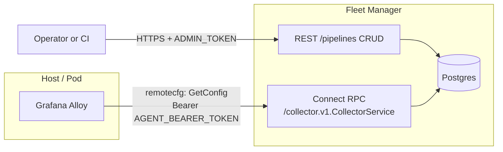

# Alloy Fleet Manager (OSS, self-hosted)

A self-hosted, vendor-neutral replacement for Grafana Cloud Fleet Management.
Built around Grafana Alloy's **native `remotecfg`** block, so Alloy itself is
the agent — no sidecar process per host.

## What you get

- **Pull-based by design.** Hosts never expose inbound control ports; Alloy
  polls the Fleet Manager.
- **Upstream-compatible protocol.** The Fleet Manager implements the
  `collector.v1.CollectorService` Connect RPC defined by
  [`grafana/alloy-remote-config`](https://github.com/grafana/alloy-remote-config)
  (Apache-2.0). Future migration to/from Grafana Cloud Fleet Management is a
  config change, not a rewrite.
- **Pipelines + selectors.** Config is composed per-collector from named
  pipelines whose `selector` (jsonb) matches a subset of the collector's
  `local_attributes`.
- **Immutable versioning.** Every pipeline edit appends a row to
  `pipeline_versions` — full audit trail + rollback by `PATCH` to an older
  content.
- **Legacy REST surface preserved.** The earlier Node.js REST + custom agent
  is kept under `/legacy/*` (see [docs/legacy-agent.md](docs/legacy-agent.md))
  so existing automation keeps working.

## High-level architecture



## Quickstart (local dev)

```bash
cp .env.example .env
# edit tokens in .env

docker compose up -d postgres
npm install
npm run build --workspace packages/shared
npm run migrate
npm run seed

# terminal 1
npm run dev:manager

# terminal 2 (optional — brings up a real Alloy wired to the manager)
docker compose --profile with-alloy up alloy

# terminal 3 (optional — dev UI with hot reload on http://localhost:5173)
npm run dev:ui

# smoke test
scripts/smoke.sh
```

Or, for the all-in-one container path:

```bash
docker compose up -d --build postgres fleet-manager
# UI ships inside the fleet-manager image:
open http://localhost:9090/ui/
```

## Docs

- [docs/architecture.md](docs/architecture.md) — components + data flow
- [docs/remotecfg.md](docs/remotecfg.md) — the primary (Alloy-native) path
- [docs/data-model.md](docs/data-model.md) — Postgres schema + rationale
- [docs/api.md](docs/api.md) — every HTTP/RPC endpoint
- [docs/development.md](docs/development.md) — local setup, migrations
- [docs/deployment.md](docs/deployment.md) — Docker + K8s + systemd
- [docs/legacy-agent.md](docs/legacy-agent.md) — the preserved REST pull model
- [docs/ui.md](docs/ui.md) — the admin UI (React SPA served at `/ui/`)
- [docs/terraform.md](docs/terraform.md) — native Terraform provider (`fleet_pipeline` resource + data sources)
- [docs/audit.md](docs/audit.md) — append-only audit log for every admin mutation
- [docs/validation.md](docs/validation.md) — strict Alloy-syntax validation via `alloy fmt`
- [docs/catalog.md](docs/catalog.md) — curated template catalog + install flow
- [docs/fleetctl.md](docs/fleetctl.md) — Go CLI for scripting/CI workflows
- [docs/sdk.md](docs/sdk.md) — `@fleet/sdk` TypeScript client for Node/browser

## Repository layout

```
alloy-fleet-oss/
  apps/
    fleet-manager/       # Fastify API — primary (remotecfg) + legacy (REST) surfaces
    fleet-agent/         # LEGACY Node.js agent (preserved, not the primary path)
    fleet-ui/            # React + Vite admin UI; built output mounted at /ui/
  packages/
    shared/              # Shared TS types + zod schemas
  proto/
    collector/v1/        # Vendored Apache-2.0 protobuf from grafana/alloy-remote-config
  catalog/
    templates.json       # Bundled pipeline template catalog (served by the manager)
  terraform/
    provider-fleet/      # Go module — native Terraform provider
    examples/basic/      # Working main.tf for a demo apply
    dev.tfrc.example     # TF_CLI_CONFIG_FILE template for local iteration
  cmd/
    fleetctl/            # Go CLI companion (cobra)
  packages/
    sdk/                 # @fleet/sdk — TypeScript client for Node/browser
  examples/
    bootstrap.alloy      # Minimal /etc/alloy/config.alloy with remotecfg block
    k8s/                 # Minimal Alloy DaemonSet manifest
  scripts/
    smoke.sh             # Manual smoke test
  docs/
  docker-compose.yml
```

## Non-goals / deferred

- GitOps sync (watch a Git repo and materialize pipelines from it)
- Staged/canary rollouts (the selector model already enables operator-driven
  canarying via attribute labelling, but a rollout controller is future work)
- Per-collector mTLS
- Manager self-observability (Prometheus `/metrics` endpoint on the manager
  itself — still on the roadmap)
