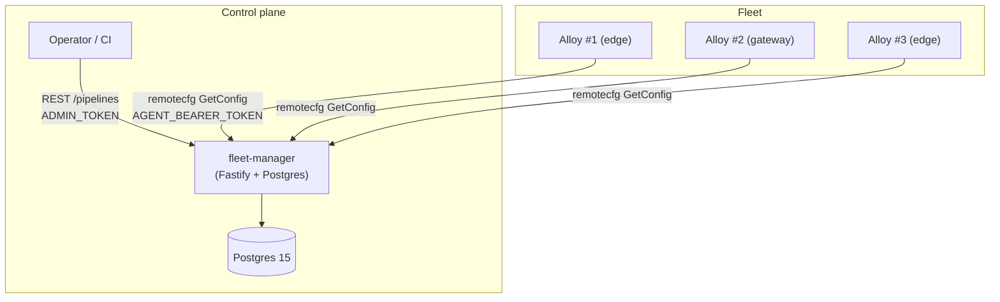
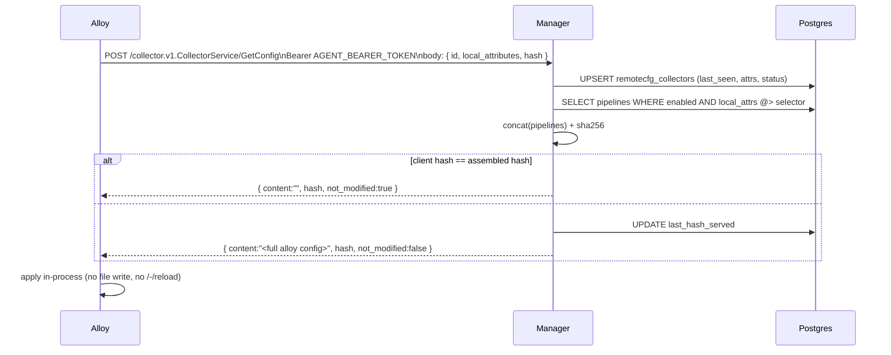

# Architecture

## Design principles (from the handoff doc)

1. Hosts **pull**, never push.
2. Configs are **immutable + versioned**.
3. **Observability first-class** — every mutation is an event; every collector
   reports status on every poll.
4. **Vendor-neutral** — talk the same wire protocol as Grafana's upstream.

## Component overview



## Two surfaces, same server

The Fleet Manager serves two parallel APIs from one process:

| Surface        | Prefix                                  | Used by                           | Auth                                |
|----------------|-----------------------------------------|-----------------------------------|-------------------------------------|
| **Primary**    | `/pipelines`, `/remotecfg/collectors`   | Humans / CI managing config       | Bearer `ADMIN_TOKEN`                |
|                | `/collector.v1.CollectorService/*`      | Alloy instances (native remotecfg)| Bearer `AGENT_BEARER_TOKEN`         |
| **Legacy**     | `/legacy/collectors/*`, `/legacy/configs/*`, `/legacy/agent/configs/:id`, `/legacy/assignments`, `/legacy/heartbeats/:id`, `/legacy/rollout_events/:id` | The preserved `apps/fleet-agent` (Node.js pull agent) | Admin / per-collector bearer       |

The **primary** surface is the recommended path for new deployments. The
**legacy** surface is preserved so that any existing integration keeps
working (per project rule: "no rewriting code without checking if you don't
cancel old logic").

## Primary request flow: Alloy → Fleet Manager



Notes:

- `GetConfig` **has side effects** on the server (it updates `last_seen` and
  optionally `last_status`), but Alloy calls it idempotently on a timer.
- `RegisterCollector` is accepted but optional — `GetConfig` already upserts
  the row, so a misconfigured Alloy that skips Register still appears in the
  inventory.
- The `hash` optimization lets an unchanged-config response be a handful of
  bytes, so we can set short `poll_frequency` without worrying about load.

## Config assembly (pipeline model)

A **pipeline** is a named chunk of Alloy config text with a **selector**
(`jsonb`). The assembler matches pipelines where `collector.local_attributes @>
pipeline.selector` (jsonb superset-contains-subset), sorts by name for
deterministic order, and concatenates:

```
// Generated by Alloy Fleet Manager. Do not edit by hand.
// Pipelines matched: base-logging@1, edge-metrics@3

// --- pipeline: base-logging (version 1) ---
logging { level = "info" format = "logfmt" }

// --- pipeline: edge-metrics (version 3) ---
prometheus.exporter.unix "default" { }
prometheus.scrape "default" { ... }
```

The `hash` in the response is a sha256 of `(name, pipeline_hash)` pairs in
sorted order — any change to a matched pipeline, OR a change to which
pipelines match a collector's attributes, flips the hash.

If you need namespace isolation (pipelines refer to components by the same
names), wrap your pipeline content in a `declare "name" { ... } name
"default" {}` block yourself — the assembler does not wrap for you.

## Immutable versioning

Every time a pipeline's content or selector changes, a row is appended to
`pipeline_versions`. The `pipelines` row holds a pointer (`current_version`,
`current_content`, `current_hash`) for fast `GetConfig` reads.

Rollback is a `PATCH /pipelines/:id` with an older `content` — it creates a
new version (so history is never lost) whose content matches a previous one.

## Failure handling

| Scenario                             | Behavior                                                        |
|--------------------------------------|-----------------------------------------------------------------|
| Invalid pipeline content on PATCH    | 400, not persisted                                              |
| Postgres unreachable                 | 500 to client; Alloy retries on next poll                       |
| Alloy reload fails server-side       | Alloy retains previous effective config; reports status=FAILED  |
|                                      | which we persist in `remotecfg_collectors.last_status / last_error` |
| Fleet Manager unreachable            | Alloy keeps running its current effective config                |

## What's deliberately out of scope

See the top-level README "Non-goals / deferred" section. The data model
reserves the extension points for each (e.g. `remote_config_status` ingestion
already flows into `last_status`, which a future UI can surface).
