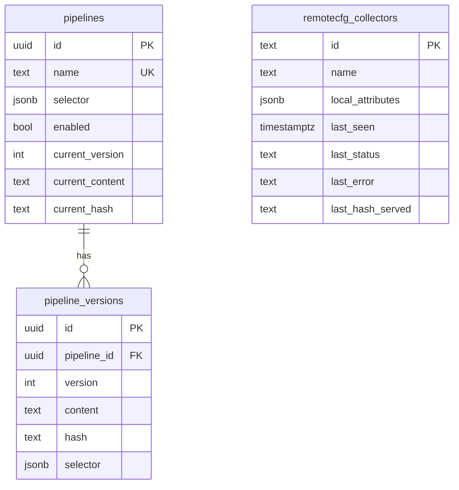

# Data model

Two disjoint groups of tables live side-by-side:

1. **Primary (remotecfg)**: `pipelines`, `pipeline_versions`, `remotecfg_collectors`
2. **Legacy (REST pull agent)**: `collectors`, `configs`, `config_versions`,
   `assignments`, `heartbeats`, `rollout_events`

Migrations are SQL files in `apps/fleet-manager/src/db/migrations/`:

| File                                        | Adds                                                     |
|---------------------------------------------|----------------------------------------------------------|
| `1700000000000_init.sql`                    | legacy REST tables                                       |
| `1700000000001_pipelines.sql`               | `pipelines`, `pipeline_versions`, `remotecfg_collectors` |

Run with `npm run migrate` (uses `node-pg-migrate` + the `DATABASE_URL` env).

## Primary: `pipelines`

Key design choices:

- **`pipelines.current_*` pointer columns** keep `GetConfig` a single-query
  `SELECT ... WHERE $attrs::jsonb @> selector ORDER BY name`. We never join
  `pipeline_versions` on the hot path.
- **`pipeline_versions` is append-only**. Every `PATCH /pipelines/:id` that
  changes `content` or `selector` bumps `current_version` and inserts a new
  row. No delete, no update.
- **`remotecfg_collectors.id` is a `text` primary key**, not a UUID, because
  the identity comes from Alloy's `remotecfg { id = ... }` (default
  `constants.hostname`). Free-form string.

## Legacy tables

See the comments in `1700000000000_init.sql` for the full schema. The short
version:

- `collectors` — one row per registered REST-pull collector, with
  `api_key_hash` for per-collector bearer auth.
- `configs` / `config_versions` — a named template and its immutable rendered
  versions (pre-rendering with `{{label.foo}}` substitution).
- `assignments` — one active `config_version` per collector.
- `heartbeats`, `rollout_events` — telemetry.

These are reachable only under `/legacy/*` on the Fleet Manager; the
`remotecfg` path ignores them. They remain because:

1. Any operator still running `apps/fleet-agent` depends on them.
2. The per-collector-rendered model is a strictly different abstraction from
   pipelines — some deployments may actually prefer it.

Removing them is a future cleanup once a deployment is fully on `remotecfg`.
