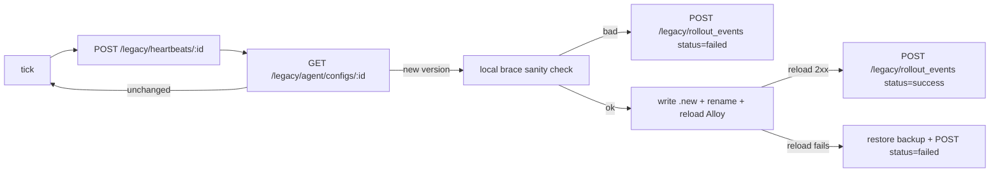

# Legacy REST agent (preserved, not the primary path)

The `apps/fleet-agent` Node.js process was the original pull-agent design —
it polls a REST endpoint on the Fleet Manager, writes to `/etc/alloy/config.alloy`
atomically, and curls `http://localhost:12345/-/reload`.

It's preserved because (a) the project rule is "no rewriting code without
checking if you don't cancel old logic", and (b) it's a useful fallback if
you need behavior that `remotecfg` doesn't give you (e.g. on-disk config
files, custom backup/revert, managing non-Alloy binaries).

## When to use it

Choose the legacy agent only if:

- You need the Alloy config to literally live on disk at a known path
  (e.g. another tool consumes it).
- You need revert-on-reload-failure behavior keyed on an HTTP reload call.
- You need per-collector bearer tokens **today** (primary path is shared
  bearer until future work lands).

Otherwise, use [`remotecfg`](remotecfg.md) — it's simpler and upstream.

## Endpoints it uses

Everything under `/legacy/*` on the Fleet Manager:

| Method  | Path                                               | Purpose                             |
|---------|----------------------------------------------------|-------------------------------------|
| POST    | `/legacy/collectors/register`                      | Register with registration token    |
| GET     | `/legacy/agent/configs/:collector_id`              | Pull rendered config                |
| POST    | `/legacy/heartbeats/:collector_id`                 | Tell the server we're alive         |
| POST    | `/legacy/rollout_events/:collector_id`             | Report apply success/failure        |

All except the first need the per-collector `api_key` that `register`
returned (hashed on the server as `collectors.api_key_hash`).

## Data model

Uses the original `collectors`, `configs`, `config_versions`,
`assignments`, `heartbeats`, `rollout_events` tables (see
[`1700000000000_init.sql`](../apps/fleet-manager/src/db/migrations/1700000000000_init.sql)).

This is disjoint from the primary pipelines model — you can't "assign a
pipeline" to a legacy collector, nor serve a legacy-configs row through
`GetConfig`. If you want to migrate a collector from legacy to primary, you
switch its bootstrap config (drop the agent, add the `remotecfg` block in
`/etc/alloy/config.alloy`).

## Reconciler loop

Every step except the initial registration is retried on the next tick
(default 30s).
